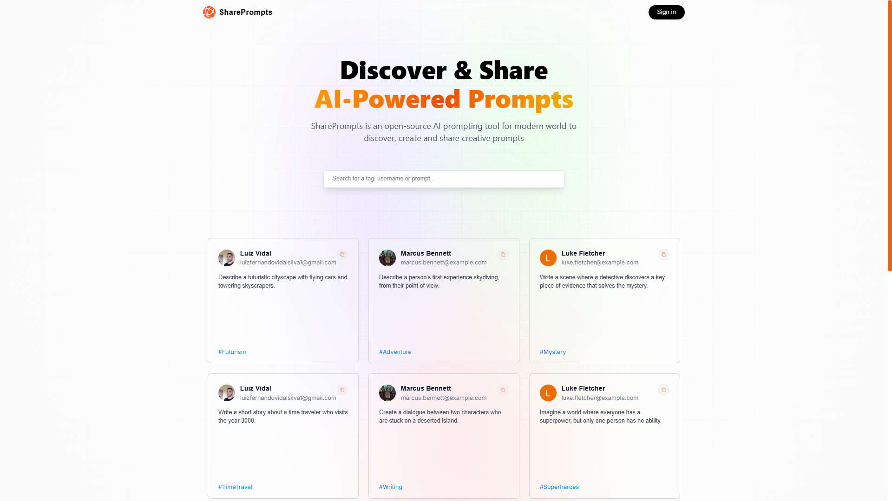

# SharePrompts - AI Prompt Sharing Platform

<div align="center">
  
</div>

SharePrompts is an open-source platform where users can discover, create, and share creative AI prompts. Built with Next.js 15, TypeScript, and MongoDB, it provides a modern, responsive interface for managing and exploring AI prompts.

## 🌟 Features

- **Google Authentication**: Secure sign-in using NextAuth with Google provider
- **CRUD Operations**: Create, read, update, and delete AI prompts
- **Profile Management**: Personal profile pages showing user's prompts
- **Responsive Design**: Mobile-friendly interface with modern animations
- **Real-time Feedback**: Toast notifications for user actions
- **Search & Filter**: Find prompts by content, tag, or username

## 🚀 Tech Stack

- **Frontend**: Next.js 15, React 19, TypeScript
- **Styling**: TailwindCSS, Framer Motion
- **Authentication**: NextAuth.js
- **Database**: MongoDB with Mongoose
- **State Management**: React Hooks
- **UI Components**: Custom components with Sonner for notifications

## 📦 Prerequisites

- Node.js 18.18.0 or higher
- MongoDB database
- Google OAuth credentials

## 🛠️ Installation

1. Clone the repository:
```bash
git clone https://github.com/yourusername/share-prompts.git
cd share-prompts
```

2. Install dependencies:
```bash
npm install
```

3. Create a `.env` file in the root directory with the following variables:
```env
MONGODB_URI=your_mongodb_connection_string
GOOGLE_ID=your_google_client_id
GOOGLE_CLIENT_SECRET=your_google_client_secret
NEXTAUTH_URL=http://localhost:3000
NEXTAUTH_URL_INTERNAL=http://localhost:3000
NEXTAUTH_SECRET=your_nextauth_secret
```

4. Run the development server:
```bash
npm run dev
```

5. Open [http://localhost:3000](http://localhost:3000) in your browser

## 📝 Project Structure

```
share-prompts/
├── src/
│   ├── actions/       # Server actions
│   ├── app/          # Next.js app router pages
│   ├── components/   # Reusable React components
│   ├── lib/          # Database models and utilities
│   ├── types/        # TypeScript type definitions
│   └── utils/        # Helper functions
├── public/           # Static assets
└── ...config files
```

## 🔑 Environment Variables

- `MONGODB_URI`: MongoDB connection string
- `GOOGLE_ID`: Google OAuth client ID
- `GOOGLE_CLIENT_SECRET`: Google OAuth client secret
- `NEXTAUTH_URL`: Your application URL
- `NEXTAUTH_URL_INTERNAL`: Internal application URL
- `NEXTAUTH_SECRET`: NextAuth.js secret key

## 🤝 Contributing

1. Fork the repository
2. Create a new branch (`git checkout -b feature/improvement`)
3. Commit your changes (`git commit -am 'Add new feature'`)
4. Push to the branch (`git push origin feature/improvement`)
5. Create a Pull Request

## 📄 License

This project is licensed under the MIT License - see the LICENSE file for details.

## 🙏 Acknowledgments

- Next.js team for the amazing framework
- Vercel for hosting and deployment
- MongoDB for database services
- Google for authentication services


